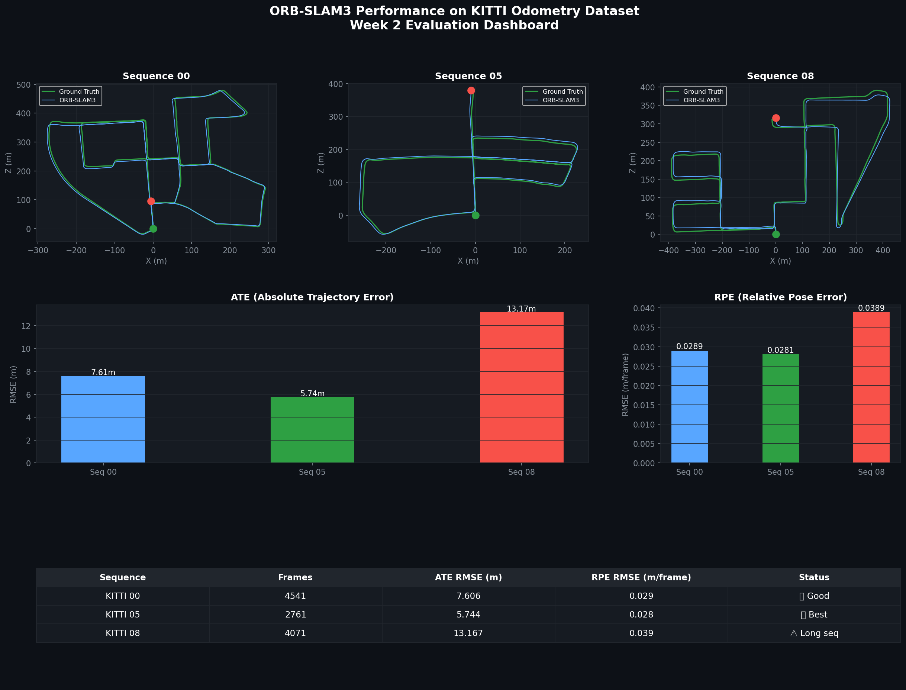

# Visual SLAM Pipeline

A production-ready Visual SLAM pipeline built with ORB-SLAM3, evaluated on the KITTI Odometry Dataset.

## Results

| Sequence | Frames | ATE RMSE (m) | RPE RMSE (m/frame) |
|----------|--------|--------------|-------------------|
| KITTI 00 | 4541   | 7.606        | 0.029             |
| KITTI 05 | 2761   | 5.744        | 0.028             |
| KITTI 08 | 4071   | 13.167       | 0.039             |



## Stack
- ORB-SLAM3 (Stereo mode)
- ROS2 Humble
- Docker
- KITTI Odometry Dataset
- evo toolbox for evaluation

## Setup
```bash
docker build -t visual-slam-pipeline:v1 -f docker/Dockerfile .
docker run -it --name slam-dev \
  -v /path/to/kitti:/data \
  -v $(pwd)/results:/workspace/results \
  -e LD_LIBRARY_PATH=/usr/local/lib \
  visual-slam-pipeline:v1
```
# Complete
