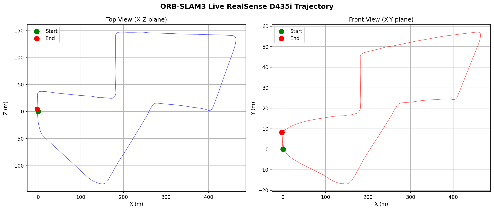

# Visual SLAM Pipeline

A Visual SLAM pipeline built with ORB-SLAM3, evaluated on KITTI Odometry and tested live on Intel RealSense D435i hardware.

**Goal:** Portfolio project targeting robotics engineering roles (Waymo, Tesla, Amazon Robotics). Documents not just results but failure modes and engineering decisions.

---

## Week 1 & 2: ORB-SLAM3 on KITTI Odometry

### Results

| Sequence | Frames | ATE RMSE (m) | RPE RMSE (m/frame) |
|----------|--------|--------------|-------------------|
| KITTI 00 | 4541   | 7.606        | 0.029             |
| KITTI 05 | 2761   | 5.744        | 0.028             |
| KITTI 08 | 4071   | 13.167       | 0.039             |


### Notes
- Sequence 08 has higher ATE (13.167m) due to a long loop with no revisited places — loop closure never fires, so drift accumulates uncorrected
- Sequences 00 and 05 benefit from loop closure reducing accumulated drift

---

## Week 3: Live Stereo-Inertial SLAM on Intel RealSense D435i

### Hardware Setup
- **Sensor:** Intel RealSense D435i (stereo IR cameras + IMU)
- **Mode:** Stereo-Inertial (IMU_STEREO) — fuses visual odometry with accelerometer/gyroscope
- **Environment:** Indoor room traversal + outdoor vehicle dashboard test

### What Changed from KITTI
KITTI uses pre-recorded stereo sequences with ground truth GPS/IMU. The RealSense test runs **live** — frames are processed in real-time as the camera captures them, with no ground truth for comparison.

The ORB-SLAM3 source code (`stereo_inertial_realsense_D435i.cc`) had two bugs that required fixing before it could be used:
1. **Missing trajectory save** — the example had no `SLAM.Shutdown()` or `SaveTrajectory()` call at exit
2. **Broken signal handler** — `Ctrl+C` set `b_continue_session = false` but the main loop checked `SLAM.isShutDown()` instead, so the process never exited cleanly

Both were fixed by patching the C++ source and recompiling.

### Results

**Outdoor vehicle  traversal:** 1443 poses captured over ~4 minutes



### Failure Mode Analysis

Running on live hardware exposed failure modes not visible on clean benchmark datasets:

| Failure | Cause | Why it matters |
|---|---|---|
| `not enough acceleration` | IMU initialization requires sufficient motion excitation to estimate gravity direction and bias | Static or slow motion prevents Visual-Inertial initialization entirely |
| `Fail to track local map` | ORB feature matching fails on textureless surfaces (plain walls, floors) or with motion blur from fast movement | Feature-based SLAM is fundamentally limited by scene texture — direct methods handle this better |
| `BAD LOOP` | Loop closure candidate found via Bag-of-Words but rejected after Sim3 geometric verification — visually similar but geometrically inconsistent | Appearance matching alone is insufficient; geometric consistency check is essential |
| IMU drift at scale | IMU integrates acceleration twice (→ velocity → position), so small bias errors accumulate as O(t²) | Without GPS anchoring, long trajectories drift even when the camera returns to its start |

### Key Insight: Why the Trajectory Doesn't Close

In the vehicle dashboard test, the camera physically returned to its starting position but the estimated trajectory shows start and end points far apart. This is **accumulated drift** — the core unsolved problem in pure SLAM:

- IMU double-integration amplifies small bias errors over time
- Visual odometry accumulates per-frame rotation and translation errors
- Loop closure can correct drift when the system re-recognizes a prior location — but requires both Bag-of-Words place recognition and Sim3 geometric verification to succeed

In production systems (Waymo, Cruise), this is addressed by fusing with GPS for absolute position anchoring, localizing against HD prior maps, and using larger vocabularies with tighter verification thresholds.

---

## Stack

- ORB-SLAM3 (Stereo + Stereo-Inertial modes)
- Intel RealSense D435i
- Docker (Ubuntu 22.04, CUDA)
- KITTI Odometry Dataset
- evo toolbox for trajectory evaluation
- Python / matplotlib for visualization

## Setup

```bash
# Build Docker image
docker build -t visual-slam-pipeline:v1 -f docker/Dockerfile .

# Run KITTI evaluation
docker run -it --name slam-dev \
  -v /path/to/kitti:/data \
  -v $(pwd)/results:/workspace/results \
  -e LD_LIBRARY_PATH=/usr/local/lib \
  visual-slam-pipeline:v1

# Run live RealSense SLAM
docker run -it --name slam-realsense \
  --privileged \
  -v /dev:/dev \
  -v $(pwd)/results:/workspace/results \
  visual-slam-pipeline:v2
```
